## ScalablyTyped Converter Architecture

This page shows the current Scala-based architecture and a proposed TypeScript-based rewrite. Both diagrams are GitHub-compatible Mermaid graphs.

### Current architecture (Scala-based)

The pipeline parses TypeScript definitions with a custom Scala parser, applies a series of TypeScript IR transforms, converts to Scala IR, and emits `.scala` sources.

```mermaid
graph TD
  A["A. Inputs<br/>TS .d.ts/.ts, tsconfig, package.json"] --> Parser["Scala Parser<br/>(TsLexer + TsParser)"]
  Parser --> Phase1["Phase1ReadTypescript<br/>Transforms Pipeline"]
  Phase1 --> LibTs["LibTs"]
  LibTs --> Phase2["Phase2ToScalaJs<br/>TS→Scala IR + Scala.js transforms"]
  Phase2 --> Printer["Printer<br/>(emit .scala)"]
  Printer --> Sources["Scala Sources (.scala)"]
  Sources --> Phase3["Phase3Compile<br/>(Bloop/SBT)"]
  Phase3 --> Out["Published Project/JARs"]
  Stdlib["node_modules/typescript/lib<br/>(stdlib)"] -.-> Parser
  CLI["CLI/CI"] --> Phase1
```

Key components:
- `TsLexer`/`TsParser` (Scala): custom TypeScript definition-file parsing
- `Phase1ReadTypescript`: TypeScript IR transforms
- `Phase2ToScalaJs` + `Printer`: Scala code generation
- `Phase3Compile`: packaging/compilation

### Proposed architecture (TypeScript-based)

Use the official TypeScript compiler API for parsing and symbol resolution, perform necessary transforms in TypeScript, and emit `.scala` directly from Node.

Highlights:
- Replace custom parsing with `typescript` Program/TypeChecker
- Keep a normalized TS IR with resolved names/exports
- Implement Scala-targeted transforms in TS
- Emit `.scala` from a TypeScript code generator

### Further reading
- Port plan (reuse Scala codegen): `docs/porting-to-ts-compiler.md`
- Full rewrite in TypeScript: `docs/rewrite-in-typescript.md`

