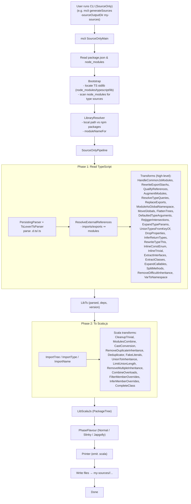

s## Scala Converter – End-to-End Flow

This diagram shows the current Scala-based pipeline from reading your `package.json` (e.g., with `class-variance-authority`) to writing generated Scala sources under `my-sources/`.

### Notes
- The stdlib is sourced from `node_modules/typescript/lib` (ensure `typescript` is installed).
- For your root `package.json` including `"class-variance-authority": "0.7.1"`, the pipeline resolves that package and its type definitions before emission.

